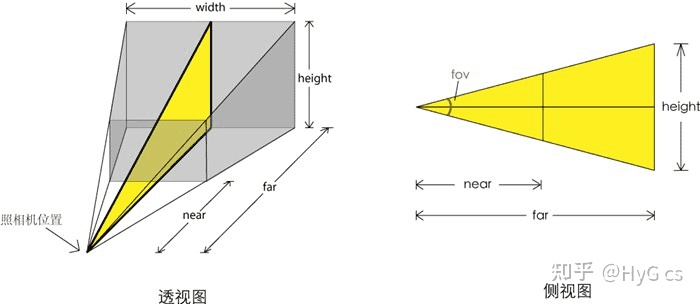
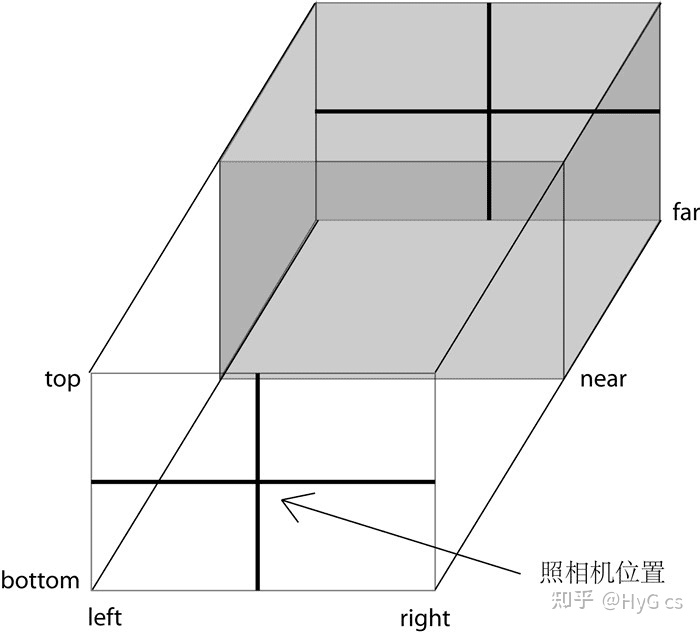

# three.js 概念
three.js是JavaScript编写的WebGL第三方库。提供了非常多的3D显示功能，主要应用于游戏开发、动画设计、智慧城市、数字孪生、模型展示等。

## 场景 scene
物体的容器，要显示的东西都要添加到场景中。

## 相机 camera
面对场景，在场景中取一个合适的景，把它拍下来。【可以想象成人的眼睛】

### 透视相机 PerspectiveCamera
new THREE.PerspectiveCamera(fov, aspect, near, far)
视野角：fov 这里视野角(有的地方叫拍摄距离)越大，场景中的物体越小，视野角越小，场景中的物体越大
纵横比：aspect
相机离视体积最近的距离：near
相机离视体积最远的距离：far



### 正交相机 OrthographicCamera
无论物体距离相机有多远，相机看到的物体大小都会一致
new THREE.OrthographicCamera(left, right, top, bottom, near, far)

left — 摄像机视锥体左侧面。
right — 摄像机视锥体右侧面。
top — 摄像机视锥体上侧面。
bottom — 摄像机视锥体下侧面。
near — 摄像机视锥体近端面。
far — 摄像机视锥体远端面。



## 相机控件 OrbitControls
通过OrbitControls.js可以对Threejs 的三维场景进行缩放，平移，旋转操作，其本质上改变的幷不是场景，而是相机的参数。
```
new OrbitControls(camera, renderer.domElement);
```

## 渲染器 renderer
将相机拍摄下来的图片，放到浏览器中去显示

```
const scene = new THREE.Scene();
const camera = new THREE.PerspectiveCamera( 75, window.innerWidth / window.innerHeight, 0.1, 1000 );

const renderer = new THREE.WebGLRenderer();
renderer.setSize( window.innerWidth, window.innerHeight );
document.body.appendChild( renderer.domElement );

const animate = () => {
  requestAnimationFrame(animate);
  renderer.render(scene, camera);
};

animate()
```

## 坐标轴
右手坐标系


## 光源

### 环境光 AmbientLight
该光源颜色会应用到场景全局，光源没有特别的来源方向，并且不会生成阴影。通常，不会将环境光作为场景中唯一的光源，因为它会将场景中的所有物体渲染为相同颜色。一般和其它光源一起使用，它只是为了弱化阴影或给场景添加一些额外的颜色，所以它的用色应该尽量保守，如果设置的颜色过于明亮，那么画面颜色就过于饱和了。
### 点光源 PointLight
从特定的一点向所有方向发射光线。夜空中的照明弹就是一个很好的点光源例子。
threejs里的点光源也没有阴影，因为它朝所有方向发射光线，这种情况下计算阴影对GPU是一个沉重的负担。
### 聚光灯 SpotLight
从特定的一点发射锥形形状的光线，这是最常使用的光源之一，特别是你想要使用阴影的话。该光源具有产生光的方向和角度，类似手电筒。
### 平行光 DirectionalLight
从二维平面发射光线，光线彼此平行。这种类型的光可以看作是距离很远的光，如太阳光，它如此遥远，以至于达到地球时所有的光线几乎都是相互平行的。它不像前面聚光灯那样离目标越远越暗淡，被平行光照亮的整个区域接收到的光强度是一样的。

## 材质 Material
材质就像物体的皮肤，决定了几何体的外表。例如，材质可以定义一个几何体看起来像金属还是木板，是否透明，什么颜色等，然后添加到Mesh中才可以添加到场景中进行渲染。
## 基础材质 MeshBasicMaterial
基础材质，可显示几何体线框，可赋予简单的颜色

## 网格Lambert材质 MeshLambertMaterial
一种非光泽表面的材质，没有镜面高光。用于创建暗淡的、不光亮的物体。

## 网格Phong材质 MeshPhongMaterial
一种用于具有镜面高光的光泽表面的材质。

## 几何体 Geometry
THREE.CircleGeometry 圆形
THREE.RingGeometry 环形
THREE.PlaneGeometry 平面
THREE.ShapeGeometry 任意图形
THREE.BoxGeometry 长方体
THREE.SphereGeometry 球体
THREE.CylinderGeometry 圆柱体
THREE.ConeGeometry 圆锥体
THREE.TorusGeometry 环形
THREE.TorusKnotGeometry 环形扭结
THREE.PolyhedronGeometry 多面体
THREE.IcosahedronGeometry 二十面体
THREE.OctahedronGeometry 八面体
THREE.TetralaHedronGeometry 四面体
THREE.DodecahedronGeometry 十二面体


## 网格 Mesh
材质+几何体=网格
```
const cubeGeometry = new THREE.CubeGeometry(10,10,10);
const cubeMaterial = new THREE.MeshLambertMaterial({color:0x00ffff});

const cube = new THREE.Mesh(cubeGeometry, cubeMaterial);

scene.add(cube);
```

## 阴影
1.渲染器开启阴影效果。
2.有一个能产生阴影的光源，并开启阴影效果。
3.有一个接受阴影投射的元素(比如地面)，并设置接受阴影的属性为true
4.有一个能产生阴影效果的物体，并开启阴影效果。

```
renderer.shadowMap.enabled = true
spotLight.castShadow = true
plane.receiveShadow = true
cube.castShadow = true
```

## 辅助对象
为了简化编码工作，threejs中内置了许多各类helper类，通过helper类，让我们能将一些看不见的对象（如光源，边界等），helper对象可以将它们展现出来，也方便我们理解。

### 坐标轴辅助对象 AxesHelper
用于简单模拟3个坐标轴的对象.
红色代表 X 轴. 绿色代表 Y 轴. 蓝色代表 Z 轴.
```
const axesHelper = new THREE.AxesHelper( 5 );
scene.add( axesHelper );
```

### 聚光灯辅助对象 SpotLightHelper
用于模拟聚光灯 SpotLight 的锥形辅助对象.
```
const spotLight = new THREE.SpotLight( 0xffffff );
spotLight.position.set( 10, 10, 10 );
scene.add( spotLight );

const spotLightHelper = new THREE.SpotLightHelper( spotLight );
scene.add( spotLightHelper );
```

## 加载器 Loader
```
import { GLTFLoader } from 'three/examples/jsm/loaders/GLTFLoader'
const loader = new GLTFLoader()
loader.setPath('./statics/models/gltf/');
loader.load('mount.gltf', function (gltf) {
    gltf.scene.traverse(function (child) {
        if (child.isMesh) {}
    });
    scene.add(gltf.scene);
})
```
创建加载器
设置gltf文件路径
开始加载文件
添加到scene

## dat.GUI
dat.GUI 是一个轻量级的图形用户界面库（GUI 组件），使用这个库可以很容易地创建出能够改变代码变量的界面组件。

## 性能监视器 stats
```
import Stats from 'three/examples/jsm/libs/stats.module.js'
let stats = new Stats()
stats.setMode(0)
stats.domElement.style.position = 'absolute' stats.domElement.style.left = '0px' stats.domElement.style.top = '0px'
document.body.appendChild(stats.domElement)
function render() {
  renderer.render(scene, camera) requestAnimationFrame(render) 
}
render()
```

实例化 Stats
设置初始面板 stats.setMode(0) 。传入面板id(0: fps, 1: ms, 2: mb)
设置监视器的位置
将监视器添加到页面中
刷新帧数 stats.update()

设置为0：监测画面每秒传输帧数(fps)
设置为1：监测渲染一帧需要的毫秒数
设置为2：监测占用的内存